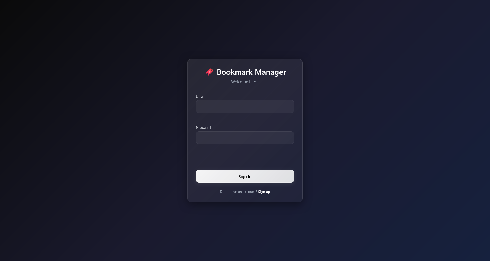
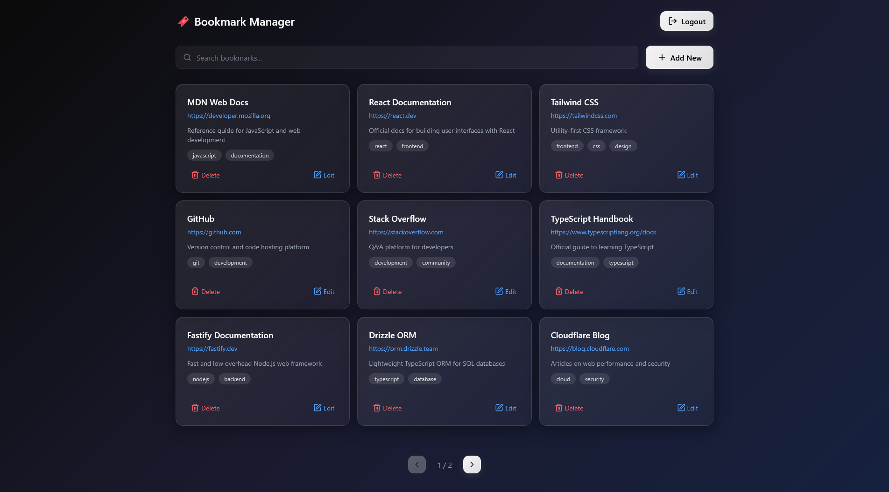
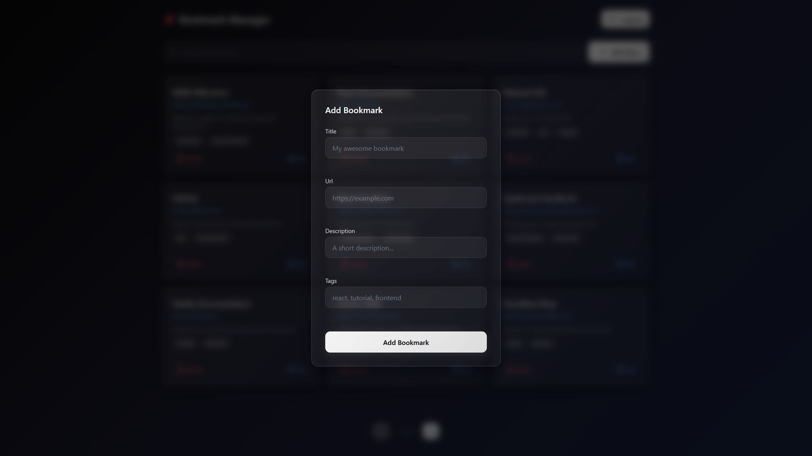

# 🔖 Bookmark Manager

A fullstack bookmark manager application where users can save, organize, and search their web bookmarks with tagging support.

**Live Demo:** [bookmark-manager-8ws.pages.dev](https://bookmark-manager-8ws.pages.dev)

## Screenshots

### Login



### Dashboard



### Add Bookmark



## Tech Stack

**Frontend:** React 19, TypeScript, TanStack Router, Tailwind CSS v4, React Hook Form, Zod

**Backend:** Node.js, Fastify, TypeScript, Drizzle ORM, PostgreSQL, JWT Authentication

**Infrastructure:** Cloudflare Pages (frontend), Render (backend & database), pnpm Workspaces (monorepo)

## Features

- User registration and login with JWT authentication
- Bookmark CRUD (create, read, update, delete)
- Tagging system with many-to-many relationships
- Full-text search across titles and descriptions
- Pagination
- Input validation with Zod (frontend & backend)
- Rate limiting on auth endpoints
- Responsive glassmorphism UI
- Protected routes with auth guards

## API Endpoints

### Authentication

- `POST /api/auth/register` — Create a new account
- `POST /api/auth/login` — Login and receive JWT token

### Bookmarks (requires authentication)

- `GET /api/bookmarks` — List bookmarks (supports `?search=`, `?page=`, `?limit=`)
- `POST /api/bookmarks` — Create a bookmark
- `PUT /api/bookmarks/:id` — Update a bookmark
- `DELETE /api/bookmarks/:id` — Delete a bookmark

## Database Schema

- **users** — id, email, password (hashed), created_at
- **bookmarks** — id, user_id (FK), title, url, description, created_at, updated_at
- **tags** — id, user_id (FK), name
- **bookmark_tags** — bookmark_id (FK), tag_id (FK) — junction table for many-to-many

## Local Development

### Prerequisites

- Node.js 18+
- pnpm
- PostgreSQL

### Setup

1. Clone the repository

```bash
   git clone https://github.com/dogukankarax/bookmark-manager.git
   cd bookmark-manager
```

2. Install dependencies

```bash
   pnpm install
```

3. Set up the database

```bash
   cd backend
   cp .env.example .env
   # Edit .env with your PostgreSQL credentials
   pnpm drizzle-kit migrate
```

4. Start development servers

```bash
   # Terminal 1 — Backend
   cd backend
   pnpm dev

   # Terminal 2 — Frontend
   cd frontend
   pnpm dev
```

5. Open `http://localhost:5173` in your browser
